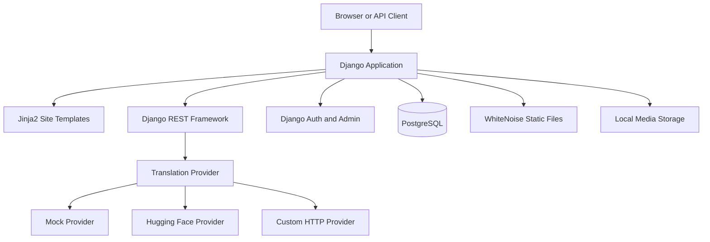

# Lafzloom

> A Django-powered multilingual shayari and poetry platform for discovering, writing, saving, translating, and sharing verses in Hindi, English, and Urdu.

[](https://www.python.org/)
[](https://www.djangoproject.com/)
[](https://www.postgresql.org/)

Lafzloom is a poetry web application built with Python, Django, Django REST Framework, PostgreSQL, Jinja2, and Tailwind CSS. It gives readers a focused way to browse shayari by category, author, language, or popularity, while signed-in users can publish verses, like and save content, and manage their collections. The project also exposes REST endpoints, JWT authentication, and a pluggable translation service for Hindi, English, and Urdu content.

The repository contains the application source, migrations, templates, static assets, automated tests, a Docker Compose stack, and a Render Blueprint. It does not currently include a public demo URL or a repository license file.

## Contents

- [Why Lafzloom](#why-lafzloom)
- [Features](#features)
- [Architecture](#architecture)
- [Technology Stack](#technology-stack)
- [Project Structure](#project-structure)
- [User Roles and Permissions](#user-roles-and-permissions)
- [Getting Started](#getting-started)
- [Environment Variables](#environment-variables)
- [Database Setup](#database-setup)
- [Translation Providers](#translation-providers)
- [API Reference](#api-reference)
- [Docker](#docker)
- [Production Deployment](#production-deployment)
- [Static and Media Files](#static-and-media-files)
- [Security](#security)
- [Testing](#testing)
- [Management Commands](#management-commands)
- [Contributing](#contributing)
- [Future Improvements](#future-improvements)
- [License](#license)

## Why Lafzloom

Lafzloom brings reading and writing shayari into one small, maintainable Django application. Its core workflow is intentionally direct:

1. Browse recent or popular shayari from the home page.
2. Search by title, text, or author and filter by category.
3. Open an individual verse to copy or share it, or translate it to another supported language.
4. Create an account to submit verses, like content, save content, and view personal collections.
5. Staff users can review, publish, hide, edit, remove, and bulk-import shayari through moderation tools and Django admin.

## Features

### Reader experience

- Home page with recent shayari and featured categories.
- Browse page with search, author and category filters, and latest, oldest, or popular sorting.
- Shayari detail pages with author and category context.
- Like and save toggles for authenticated users.
- Client-side copy and share actions, including Web Share API support with a clipboard fallback.
- Language switching for the site interface across English, Hindi, and Urdu strings.
- Responsive Jinja2 templates with Tailwind CSS loaded from the public CDN and project CSS.

### Writing and accounts

- Registration with username, email, password, and password confirmation.
- Login with either a case-insensitive username or email address.
- Session-based web authentication using Django's built-in `User` model.
- Password reset by email link.
- Authenticated profile page showing authored, saved, and liked shayari.
- Authenticated users can submit, edit, and delete their own shayari.

### Moderation and administration

- Staff-only moderation views for publishing, unpublishing, editing, and removing shayari.
- Django admin for categories and shayari with filters, search, and bulk approval.
- `.xlsx` import workflow in Django admin with language aliases, category creation, author lookup, defaults, and warning reporting.
- Publication visibility represented by the `approved` field on each shayari record.

### API and translation

- Django REST Framework CRUD endpoints for shayari and read-only category endpoints.
- JWT token and refresh endpoints for API clients.
- Session authentication for API requests is also enabled.
- Translation endpoint supporting Hindi (`hi`), English (`en`), and Urdu (`ur`).
- Translation provider selection through environment variables: mock, Hugging Face Inference API, or a custom HTTP service.

## Architecture

Lafzloom is a server-rendered Django application with Jinja2 site templates and Django templates for the admin interface. PostgreSQL is the configured production database. WhiteNoise serves collected static assets, while Docker Compose can place Nginx in front of the web container for static and media file delivery.



The `/healthz/` endpoint returns a basic JSON status response for deployment health checks. The application entrypoint runs migrations, collects static files, and starts Gunicorn.

## Technology Stack

| Area | Technology |
| --- | --- |
| Language | Python 3.12.x |
| Web framework | Django 6.x |
| Site templates | Jinja2 through Django's Jinja backend |
| API | Django REST Framework |
| API authentication | Django REST Framework session authentication and Simple JWT |
| Database | PostgreSQL; SQLite is not configured by the project |
| Static assets | Django staticfiles and WhiteNoise |
| Frontend | Tailwind CSS CDN, custom CSS, and vanilla JavaScript |
| Translation | Mock, Hugging Face Inference API, or custom HTTP provider |
| Production server | Gunicorn |
| Containerization | Docker and Docker Compose |
| Spreadsheet import | openpyxl for `.xlsx` files |
| Hosting configuration | Render Blueprint in `render.yaml` |

## Project Structure

```text
lafzloom/
├── accounts/                 # Registration, login, profile, and password reset
├── moderation/               # Staff-only moderation views and templates
├── shayari/                  # Models, forms, views, REST API, admin, and import command
│   ├── management/commands/  # Project-specific Django management commands
│   ├── migrations/            # Shayari and category database migrations
│   └── templates/             # Shayari page templates
├── translation/              # Translation API, service, and provider adapters
│   └── providers/             # Mock, Hugging Face, and HTTP providers
├── lafzloom/                 # Django settings, URLs, WSGI/ASGI, Jinja setup
├── templates/                # Shared layouts, pages, and partials
├── django_templates/         # Django-template overrides, including admin UI
├── static/                   # CSS, JavaScript, logo, and favicon
├── scripts/                  # Container and Render entrypoint
├── nginx/                    # Nginx reverse-proxy configuration for Compose
├── Dockerfile                # Python application image
├── docker-compose.yml        # Web, PostgreSQL, and Nginx development stack
├── render.yaml               # Render web service and PostgreSQL Blueprint
├── manage.py                 # Django command-line entry point
├── requirements.txt          # Python dependencies
├── runtime.txt               # Python runtime declaration for compatible hosts
└── README.md                 # Project documentation
```

## Core Data Model

The application currently has two project-owned content models:

| Model | Purpose |
| --- | --- |
| `Category` | A named, slugged category with an optional description. |
| `Shayari` | A verse with title, text, language, category, author, approval state, timestamps, likes, and saves. |

Accounts use Django's built-in `User` model. Supported shayari languages are Hindi, English, and Urdu. A shayari is publicly listed only when `approved=True`, except that its author and staff users can view an unpublished record through the HTML detail view.

## User Roles and Permissions

Lafzloom does not define a custom role model or group-based permission system. Access is based on Django authentication flags and ownership:

| User type | Capabilities |
| --- | --- |
| Anonymous visitor | Browse approved shayari, search, filter, sort, view categories and details, and use public API reads. |
| Authenticated user | Register/login session, submit shayari, edit/delete owned shayari, like, save, view profile collections, use password reset, and create shayari through the API. |
| Staff user | Access the moderation area, view all shayari, publish or hide content, edit/remove records, and use staff API permissions. |
| Superuser | Django superuser access in addition to the staff behavior used by the site. |

Web submissions currently set `approved=True` immediately. API submissions by regular users are created with `approved=False`; staff API submissions are approved on creation. Staff can change publication status afterward through moderation or admin.

## Getting Started

### Prerequisites

- Python 3.12 or a compatible Python version supported by Django 6.x.
- PostgreSQL 16 or another compatible PostgreSQL installation for a native setup.
- Git.

### 1. Clone the repository

```bash
git clone https://github.com/1abhishek0948/lafzloom.git
cd lafzloom
```

### 2. Create and activate a virtual environment

macOS and Linux:

```bash
python3 -m venv .venv
source .venv/bin/activate
```

Windows PowerShell:

```powershell
py -3.12 -m venv .venv
.venv\Scripts\Activate.ps1
```

### 3. Install dependencies

```bash
python -m pip install --upgrade pip
pip install -r requirements.txt
```

### 4. Configure the environment

Copy the committed example and update values for your local database and email setup:

```bash
cp .env.example .env
```

On Windows PowerShell:

```powershell
Copy-Item .env.example .env
```

The default development configuration uses Django's console email backend and the mock translation provider. See [Environment Variables](#environment-variables) for the complete list of supported settings.

### 5. Apply migrations

```bash
python manage.py migrate
```

### 6. Create an administrator

```bash
python manage.py createsuperuser
```

### 7. Optionally load sample content

```bash
python manage.py seed_data
```

This creates a `demo` account and sample categories and shayari when they do not already exist. The command contains a development-only demo password in source code; change or remove that account before using seeded data outside local development.

### 8. Start the development server

```bash
python manage.py runserver
```

Open [http://127.0.0.1:8000/](http://127.0.0.1:8000/). The Django admin is available at `/admin/`, and the health endpoint is available at `/healthz/`.

## Environment Variables

The project loads `.env` from the repository root with `python-dotenv`. The following variables are read by the application or deployment configuration.

### Application and database

| Variable | Purpose | Development behavior |
| --- | --- | --- |
| `DEBUG` | Enables Django debug behavior. | Defaults to `1`/true. Set to `0` in production. |
| `SECRET_KEY` | Django signing and cryptographic key. | A development fallback exists; set a strong private value outside local development. |
| `ALLOWED_HOSTS` | Comma-separated hostnames accepted by Django. | Defaults to `localhost,127.0.0.1` when debug is enabled. |
| `CSRF_TRUSTED_ORIGINS` | Comma-separated trusted origins. | Defaults to local HTTP origins when debug is enabled. |
| `DATABASE_URL` | PostgreSQL connection URL, preferred for deployment. | Optional when individual PostgreSQL variables are supplied. |
| `POSTGRES_DB` | PostgreSQL database name. | Defaults to `lafzloom`. |
| `POSTGRES_USER` | PostgreSQL username. | Defaults to `lafzloom`. |
| `POSTGRES_PASSWORD` | PostgreSQL password. | Defaults to `lafzloom` only for local debug configuration. |
| `POSTGRES_HOST` | PostgreSQL host. | Defaults to `localhost`. Use `db` with the included Compose stack. |
| `POSTGRES_PORT` | PostgreSQL port. | Defaults to `5432`. |
| `LANGUAGE_CODE` | Default interface language. | Defaults to `en`. |
| `TIME_ZONE` | Django timezone. | Defaults to `UTC`. |

### Email and server

| Variable | Purpose |
| --- | --- |
| `EMAIL_BACKEND` | Django email backend. Development defaults to the console backend; production defaults to SMTP. |
| `DEFAULT_FROM_EMAIL` | Sender address for password reset messages. |
| `EMAIL_HOST` | SMTP host. |
| `EMAIL_PORT` | SMTP port; defaults to `587`. |
| `EMAIL_USE_TLS` | Enables SMTP TLS. |
| `EMAIL_USE_SSL` | Enables SMTP SSL. |
| `EMAIL_TIMEOUT` | SMTP timeout in seconds; defaults to `15`. |
| `EMAIL_HOST_USER` | SMTP username. |
| `EMAIL_HOST_PASSWORD` | SMTP password. |
| `EMAIL_SSL_CERTFILE` | Optional custom CA certificate path. |
| `WEB_CONCURRENCY` | Gunicorn worker count; defaults to `1` in the entrypoint. |
| `GUNICORN_TIMEOUT` | Gunicorn request timeout in seconds; defaults to `120`. |
| `RENDER_EXTERNAL_HOSTNAME` | Render hostname automatically added to allowed hosts and CSRF origins when supplied by Render. |

### Translation

| Variable | Purpose |
| --- | --- |
| `TRANSLATION_PROVIDER` | `mock`, `hf`, or `http`; defaults to `mock`. |
| `TRANSLATION_TIMEOUT_SECONDS` | Upstream translation timeout; defaults to `20`. |
| `HF_API_TOKEN` | Token for the Hugging Face provider. |
| `HF_MODEL_HI_EN` | Optional Hindi-to-English model override. |
| `HF_MODEL_EN_HI` | Optional English-to-Hindi model override. |
| `HF_MODEL_HI_UR` | Optional Hindi-to-Urdu model override. |
| `HF_MODEL_UR_HI` | Optional Urdu-to-Hindi model override. |
| `HF_MODEL_EN_UR` | Optional English-to-Urdu model override. |
| `HF_MODEL_UR_EN` | Optional Urdu-to-English model override. |
| `LLM_API_URL` | URL for the custom HTTP translation provider. |
| `LLM_API_KEY` | Optional bearer token for the custom HTTP provider. |

### Production security flags

| Variable | Purpose |
| --- | --- |
| `SESSION_COOKIE_SECURE` | Sends the session cookie only over HTTPS. |
| `CSRF_COOKIE_SECURE` | Sends the CSRF cookie only over HTTPS. |
| `SECURE_SSL_REDIRECT` | Redirects HTTP requests to HTTPS. |
| `SECURE_HSTS_SECONDS` | HSTS duration in seconds. |
| `SECURE_HSTS_INCLUDE_SUBDOMAINS` | Includes subdomains in HSTS. |
| `SECURE_HSTS_PRELOAD` | Enables HSTS preload signaling. |
| `SECURE_CONTENT_TYPE_NOSNIFF` | Enables the `nosniff` response header. |
| `X_FRAME_OPTIONS` | Clickjacking protection header; defaults to `DENY`. |

Never commit `.env` or real credentials. The repository `.gitignore` excludes `.env`, local media, and collected static files.

## Database Setup

### Native PostgreSQL

Create a PostgreSQL database and user, then set the `POSTGRES_*` variables in `.env` or provide a `DATABASE_URL`. For a local database, the minimal values are:

```env
DEBUG=1
SECRET_KEY=replace-with-a-local-secret
POSTGRES_DB=lafzloom
POSTGRES_USER=lafzloom
POSTGRES_PASSWORD=replace-with-a-local-password
POSTGRES_HOST=localhost
POSTGRES_PORT=5432
```

Then run:

```bash
python manage.py migrate
```

### Render PostgreSQL

The included [`render.yaml`](./render.yaml) provisions a Render PostgreSQL database and passes its connection string to the web service as `DATABASE_URL`. The entrypoint applies migrations before starting Gunicorn.

## Translation Providers

The default `mock` provider returns the input text unchanged. This is useful for local UI development but is not a real translation service.

### Hugging Face Inference API

Set the provider and token:

```env
TRANSLATION_PROVIDER=hf
HF_API_TOKEN=replace-with-a-hugging-face-token
```

The provider has built-in Helsinki-NLP model defaults for the six supported language directions. Set `HF_MODEL_<SOURCE>_<TARGET>` variables when a different model is required.

### Custom HTTP provider

Set:

```env
TRANSLATION_PROVIDER=http
LLM_API_URL=https://your-service.example/translate
LLM_API_KEY=replace-with-a-private-key
```

The provider sends:

```json
{
  "text": "...",
  "source_lang": "hi",
  "target_lang": "en",
  "style": "poetic"
}
```

It expects a JSON response containing either `translation` or `text`:

```json
{
  "translation": "..."
}
```

The translation API returns HTTP `503` when a configured provider reports a translation error. The browser integration is implemented in [`static/js/app.js`](./static/js/app.js).

## API Reference

The API is rooted at `/api/`. DRF supports JWT and session authentication, while global permissions default to public access; write-capable endpoints define their own authentication and ownership checks.

### Shayari and categories

| Method | Endpoint | Access | Purpose |
| --- | --- | --- | --- |
| `GET` | `/api/shayaris/` | Public | List approved shayari. Supports `q`, `category`, `author`, and `sort=popular\|latest\|oldest`. |
| `POST` | `/api/shayaris/` | Authenticated | Create a shayari. Regular-user submissions start unpublished. |
| `GET` | `/api/shayaris/{id}/` | Public for approved records | Retrieve one shayari. |
| `PUT/PATCH` | `/api/shayaris/{id}/` | Author or staff | Update an owned or staff-accessible shayari. |
| `DELETE` | `/api/shayaris/{id}/` | Author or staff | Delete an owned or staff-accessible shayari. |
| `POST` | `/api/shayaris/{id}/like/` | Authenticated | Toggle a like and return the count. |
| `POST` | `/api/shayaris/{id}/save/` | Authenticated | Toggle a saved item. |
| `GET` | `/api/categories/` | Public | List categories. |
| `GET` | `/api/categories/{id}/` | Public | Retrieve one category. |

### JWT authentication

Obtain and refresh access tokens using the Simple JWT endpoints:

```http
POST /api/token/
POST /api/token/refresh/
```

The token endpoint accepts Django username/password credentials. Use the returned access token as a bearer token for authenticated API requests.

### Translation

```http
POST /api/translate/
Content-Type: application/json
```

Request body:

```json
{
  "text": "A verse to translate",
  "source_lang": "hi",
  "target_lang": "en"
}
```

Successful response:

```json
{
  "translation": "..."
}
```

The endpoint accepts `hi`, `en`, and `ur` for both language fields. The repository does not include an OpenAPI schema or interactive API documentation endpoint.

## Docker

Docker Compose provisions three services:

- `web`: the Django application and Gunicorn entrypoint.
- `db`: PostgreSQL 16 with a persistent named volume.
- `nginx`: reverse proxy serving static and media files and forwarding application traffic.

Create the environment file first:

```bash
cp .env.example .env
```

For Compose, set the database host to the service name:

```env
POSTGRES_HOST=db
```

Start the stack:

```bash
docker compose up --build
```

Open [http://localhost/](http://localhost/). Stop the services with `Ctrl+C`, or run `docker compose down`. Named volumes preserve PostgreSQL, collected static, and media data across ordinary container recreations.

The Compose database credentials are declared in `docker-compose.yml`. Change them before using the stack in a shared or production environment.

## Production Deployment

### Render Blueprint

Render deployment is configured in [`render.yaml`](./render.yaml). It defines:

- A Render PostgreSQL database named `lafzloom`.
- A Python web service named `lafzloom-web`.
- Python `3.12.8`.
- Build command: `pip install -r requirements.txt`.
- Start command: `./scripts/entrypoint.sh`.
- Health check path: `/healthz/`.
- Auto-deploy enabled.

To deploy through Render:

1. Create a new Blueprint instance from this repository.
2. Review the generated PostgreSQL and web service settings.
3. Provide the SMTP values marked `sync: false` if password-reset email is required.
4. Configure `ALLOWED_HOSTS` and `CSRF_TRUSTED_ORIGINS` when using a custom domain.
5. Verify HTTPS and the `/healthz/` endpoint after deployment.

The entrypoint runs migrations and static collection before starting Gunicorn:

```bash
python manage.py migrate --noinput
python manage.py collectstatic --noinput
```

The exact Gunicorn bind address, worker count, and timeout are controlled by `PORT`, `WEB_CONCURRENCY`, and `GUNICORN_TIMEOUT` in the entrypoint.

### Procfile-compatible hosts

The repository also includes a `Procfile` with:

```text
web: ./scripts/entrypoint.sh
```

Any host that supports Procfile-style web processes and provides PostgreSQL, Python 3.12, environment variables, and persistent media storage can use this entrypoint, but no other hosting provider configuration is included in the repository.

## Static and Media Files

- Source static assets live in [`static/`](./static/).
- Collected static assets are written to `staticfiles/`.
- WhiteNoise uses `CompressedManifestStaticFilesStorage` for static files.
- Uploaded media is stored under `media/` using Django's local filesystem storage.
- Django serves media from development URLs only when `DEBUG` is enabled.
- Docker Compose mounts named volumes for static and media data and lets Nginx serve them.
- Render does not automatically provide durable local media storage; attach persistent storage at `/opt/render/project/src/media` if the deployment needs uploaded media to survive service replacement.

The current data model does not define an image or avatar upload workflow, so media storage is infrastructure support rather than a currently documented user-facing feature.

## Security

### Implemented protections

- Django CSRF middleware and CSRF hidden inputs in Jinja forms.
- Jinja autoescaping enabled for site templates.
- Django password hashing and built-in password validators.
- Login-required decorators for profile, submission, edit/delete, like, and save flows.
- Staff-only decorators for moderation views.
- Ownership checks for shayari edits and deletes.
- Safe redirect validation for user-provided `next` URLs.
- Environment-controlled `DEBUG`, `SECRET_KEY`, allowed hosts, and CSRF origins.
- Production defaults for secure cookies, HTTPS redirects, HSTS, content-type sniffing protection, and `X_FRAME_OPTIONS`.
- PostgreSQL SSL required for `DATABASE_URL` connections when `DEBUG=0`.

### Production checklist

- Set a long, unique `SECRET_KEY` and `DEBUG=0`.
- Configure exact `ALLOWED_HOSTS` and `CSRF_TRUSTED_ORIGINS` values.
- Use HTTPS and verify the proxy's forwarded-protocol configuration.
- Replace Compose's example PostgreSQL credentials before sharing the stack.
- Configure a real SMTP backend before relying on password reset in production.
- Use a persistent media volume or external storage if user-uploaded files are introduced.
- Review the open translation endpoint before exposing it publicly; the current implementation has no authentication, throttling, or server-side translation cache.
- Add pagination and abuse controls before operating with a large public dataset.

The project currently has no email verification or OTP flow, custom profile model, granular group permissions, moderation audit trail, reports, flags, or automated content checks.

## Testing

Tests are located in [`shayari/tests.py`](./shayari/tests.py) and run with Django's test runner:

```bash
python manage.py test
```

The current suite covers:

- Basic `Shayari` model string conversion.
- Public API listing.
- Unauthenticated API create rejection.
- Legacy category URL redirect behavior.
- `.xlsx` import creation, invalid-language skipping, and default values.

Coverage is currently narrow. Account flows, moderation authorization, translation providers, JWT behavior, likes and saves, web submission behavior, and deployment configuration are not comprehensively tested.

## Management Commands

### Seed development data

```bash
python manage.py seed_data
```

Creates or reuses a `demo` user, five categories, and five approved sample shayaris. Treat this as development tooling and inspect the command before running it against a shared database.

### Standard Django commands

```bash
python manage.py check
python manage.py makemigrations
python manage.py migrate
python manage.py collectstatic
python manage.py createsuperuser
```

## SEO and Discoverability

The application has page titles, viewport metadata, and a favicon. It does not currently implement meta descriptions, canonical URLs, Open Graph or Twitter card metadata, structured data, a sitemap, or `robots.txt`. These are reasonable follow-up improvements for a public poetry and shayari site.

This README uses repository-confirmed terms such as `Django`, `Python`, `PostgreSQL`, `Django REST Framework`, `shayari`, `poetry`, `Hindi`, `English`, `Urdu`, and `translation API` naturally. Documentation cannot guarantee search rankings; discoverability also depends on application SEO, content quality, accessibility, links, activity, and search-engine indexing.

## Contributing

Contributions are welcome. Before opening a pull request:

1. Create a focused branch from the current default branch.
2. Set up the project using the local instructions above.
3. Run `python manage.py check` and `python manage.py test`.
4. Update tests and documentation when behavior changes.
5. Keep credentials, `.env`, local media, and generated static files out of commits.
6. Describe the user-visible and operational impact in the pull request.

There is no repository-specific `CONTRIBUTING.md` or code of conduct at present.

## Future Improvements

These are suggested next steps based on the current architecture, not existing features:

- Add pagination, API throttling, and abuse controls for public lists and translation requests.
- Add moderation states, rejection reasons, moderator identity, and an audit history.
- Align web submission behavior with the API's unpublished workflow if a true moderation queue is required.
- Add metadata, canonical URLs, Open Graph cards, structured data, sitemap, and robots directives for public shayari pages.
- Expand automated tests around accounts, permissions, moderation, translation, and production settings.
- Add an API schema and versioning strategy as external clients grow.
- Consider durable object storage for media if image or avatar features are added.
- Add richer discovery features such as language-specific browsing and recommendations after usage requirements are clear.

## License

No `LICENSE` file or explicit license declaration was found in the repository. Do not assume that the code is available for reuse under an open-source license until the project owner adds one.

## Repository Information

**Repository:** [github.com/1abhishek0948/lafzloom](https://github.com/1abhishek0948/lafzloom)<br>
**Issue tracker:** [GitHub Issues](https://github.com/1abhishek0948/lafzloom/issues)<br>
**Project description:** Multilingual Django shayari platform for Hindi, English, and Urdu poetry, with REST APIs, JWT authentication, and pluggable translation.

### Recommended GitHub topics

`django` `python` `postgresql` `django-rest-framework` `jwt-authentication` `jinja2` `poetry` `shayari` `hindi` `urdu` `multilingual` `translation-api` `docker` `render`
